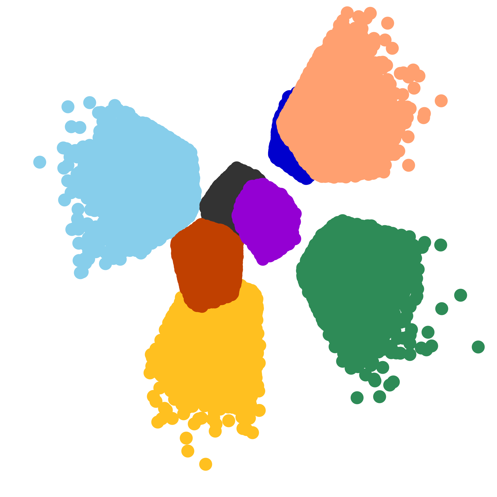

## Paul Mycek
Senior researcher at [Cerfacs][cerfacs], Toulouse, France

Member of the joint [Inria][inria]-Industry team [Concace](https://concace.gitlabpages.inria.fr/) between [Airbus](https://www.airbus.com/) Central R&T, [Cerfacs][cerfacs] and [Inria][inria].

Member of [CECI](https://cerfacs.fr/en/umr-5318-climate-environment-coupling-uncertainties/), UMR 5318, [CNRS](https://www.cnrs.fr/)-[Cerfacs][cerfacs].

[cerfacs]: https://cerfacs.fr/
[inria]: https://www.inria.fr/
